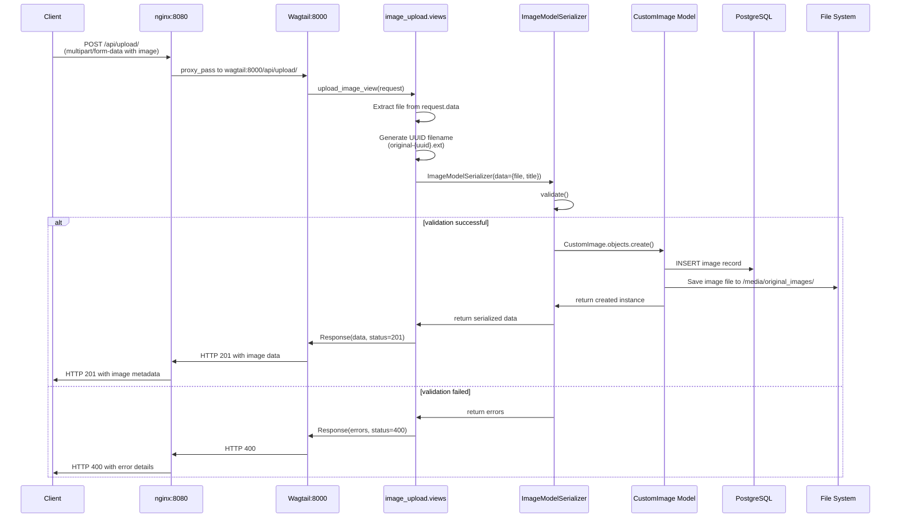
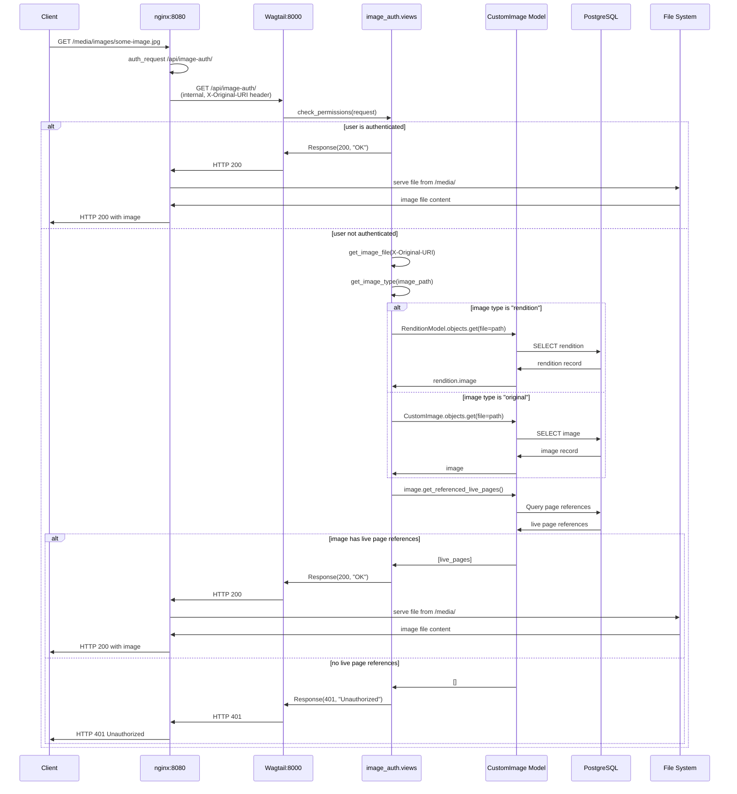
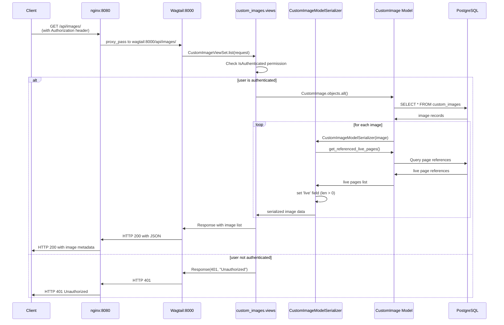

# Cheminova Backend

Wagtail CMS and API backend for the Cheminova site, providing:

- A single “Home” page with image support
- Secure image upload and per-request authorization
- Custom image model with renditions and live-page tracking
- JSON API endpoints for pages and images
- Containerized development and deployment with Docker & Docker Compose

---

## Table of Contents

- [Prerequisites](#prerequisites)
- [Installation](#installation)
- [Running Tests](#running-tests)
- [Deployment](#deployment)

---

## Prerequisites

- **[uv](https://docs.astral.sh/uv/getting-started/installation/)**
- **Docker & Docker Compose** (for containerized workflows)

### Running scripts with `uv` and `invoke`

Scripts are defined in `tasks.py` and can be run with `uv`:

```bash
uv run invoke <task-name>
```

List available tasks:

```bash
uv run invoke --list
```

Available tasks:

- bump: Bump version using uv version and create a git tag.
- dev: Run the development server with docker compose.
- export-dump: Dump database and export dump to S3.
- format: Format code using ruff.
- import-dump: Import dump from S3 and load it into the database.
- sync-assets: Sync static and media assets from S3 to local storage.
- test: Run tests using django test framework.

---

## Installation

Clone the repo:

`git clone ***REMOVED***
cd cheminova-backend`

## Local Development (Docker Compose)

- Confugure environment variables

```bash
cp .env.example .env
```

and edit `.env` to set variables as needed.

- Configure the Minio client

```bash
cp config/mc/config.json.example config/mc/config.json
```

and edit it to set access key and secret key for the different environments.

- Bring up the full stack (Postgres, Wagtail, Nginx, Minio)

```bash
uv run invoke dev
```

- Wagtail runs at <http://localhost:8000/>
- Nginx proxy at <http://localhost:8080/>

- Apply database migrations

```bash
docker compose exec wagtail uv run manage.py migrate
```

- Create a superuser

```bash
docker compose exec wagtail uv run manage.py createsuperuser
```

- Create a default site

- Import site data from dev.***REMOVED*** (optional)

```bash
uv run invoke import-dump dev-cheminova <latest-dump-filename>
```

## Running Tests

```bash
uv run invoke test
```

## Deployment

1. Build and push Docker images in GitLab CI (see [.gitlab-ci.yml](.gitlab-ci.yml)).

2. In production, ensure the following env vars are set:
   • SECRET_KEY
   • POSTGRES_DB, POSTGRES_USER, POSTGRES_PASSWORD, POSTGRES_HOST
   • (Optional) BASE_PATH if serving under a subpath

3. The [production.py](cheminova/settings/production.py) settings module will configure:
   • Secure proxy headers
   • CSRF trusted origins
   • Wagtail admin base URL

## Dump Database and Backup to S3

```bash
docker compose exec wagtail uv run manage.py export_dump
```

## Restore Database

Choose a dump file in the S3 bucket (e.g. [dev-cheminova/db-dump](https://***REMOVED***) for dumps from dev.***REMOVED***). To restore the database from a dump file, you can use the following command:

```bash
docker compose exec wagtail uv run manage.py import_dump $DUMP_FILENAME
```

Users and site data will be restored from the local database unless the `--no-restore-local-data` flag is provided.

## Image Upload Flow



## Image Request Flow (with Authentication)



## Image API Request Flow (Metadata)


